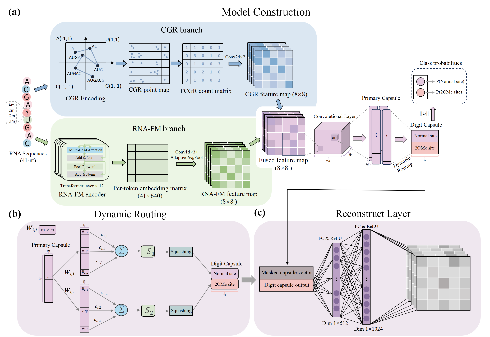

# Caps-2OMe: An interpretable multimodal deep learning framework for accurate RNA 2′-O-methylation site prediction

This repository provides the implementation of Caps-2OMe, a deep learning framework for RNA 2′-O-methylation site prediction. The model fuses CGR and RNA-FM features and uses a capsule network for classification and interpretability analysis.

## Key features
- **Multimodal feature learning**: combines CGR-based spatial encoding and RNA-FM-based contextual sequence representation.
- **Capsule-based classification**: uses dynamic routing to model hierarchical feature relationships and improve discrimination.
- **Interpretable design**: supports analysis of capsule routing patterns, prediction confidence, and motif-level biological signals.
- **Robust performance**: achieves strong results on both cross-validation and independent test sets.

## Framework

